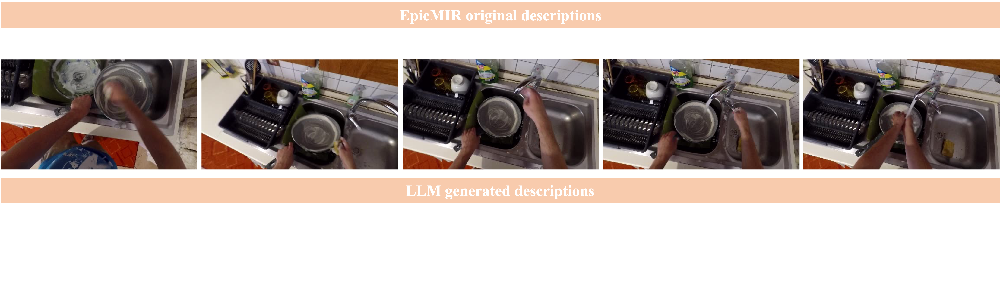

# Audio Retrieval in Egocentric Videos

[Project page](https://github.com/oncescuandreea/audio_egovlp) | [arXiv](https://arxiv.org/abs/2402.19106)




# <span style='color:red'>‼️ Codebase under construction‼️</span> check back later

## Installing environment
To be able to run the code, follow the steps below:

```
conda env create -f environment.yml
conda activate egovlp
python -m nltk.downloader stopwords
export PYTHONPATH=.
```

## Datasets needed
1. AudioEgoMCQ
2. AudioEpicMIR
3. EpicSounds


### AudioEgoMCQ
Before being able to run the AudioEgoMCQ experiments, one needs to first download the needed **Ego4D** data which in turns first requires [completing a lincense agreement](https://ego4d-data.org/docs/start-here/#license-agreement). Once approval and credentials are obtained, follow intructions [here](https://github.com/showlab/EgoVLP?tab=readme-ov-file#ego4d-videos-and-metadata) to download the needed data for related experiments.

Also download the following for [EgoClip](https://github.com/showlab/EgoVLP?tab=readme-ov-file#egoclip-an-egocentric-video-language-pretraining-dataset) and [EgoMCQ](https://github.com/showlab/EgoVLP?tab=readme-ov-file#egomcq-an-egocentric-video-language-development-set):
```
mkdir dataset
cd dataset
gdown "https://drive.google.com/uc?id=1-aaDu_Gi-Y2sQI_2rsI2D1zvQBJnHpXl"
gdown "https://drive.google.com/uc?id=1-5iRYf4BCHmj4MYQYFRMY4bhsWJUN3rW"
cd ..
gdown --folder https://drive.google.com/drive/folders/1gWto7N5rh5nmbWl3JGYsH5wYFzmSBi6J -O dataset/
mv dataset/audio_retrieval_egomcq/* dataset/.
rm -r dataset/audio_retrieval_egomcq/
```

Once data has been downloaded, follow the lines below to process it and extract video chunks and audios:
```
mkdir -p dataset
cd dataset
ln -s <path_to_ego4d_video_folder> ego4d
cd ..
python utils/video_resize.py --nproc 10 --subset mcq
python utils/video_chunk.py --task video_chunks --dataset egovlp --nproc 10
python utils/video_chunk.py --task audio_chunks --dataset egovlp --nproc 10
```
Select subset flag to be mcq if only interested in the MCQ subset where we have both video and audio content. Otherwise, select all which is also the default option.


### AudioEpicMIR and EpicSounds
The first step in running experiments on AudioEpicMIR and EpicSounds is downloading the EpicKitchens data. For that, follow instructions in this [repo](https://github.com/epic-kitchens/epic-kitchens-download-scripts). Tl;dr once repo is cloned for only the test data, run:
```
python epic_downloader.py --videos --test
```

To get the ```epic-kitchens-100-annotations``` content follow the lines below and then download the files from the link above.
```
mkdir data
cd data
git clone git@github.com:epic-kitchens/epic-kitchens-100-annotations.git
cd ..
```

For **EpicSounds**, the data is the same as for **EpicMIR**, only sentences are different. Relevant descriptions in the format needed are found in [this folder](https://drive.google.com/drive/folders/1OSYniORkyyhxPcClccZHkH73TS4WoenE?usp=drive_link). Download these files and put them in the ```epic-kitchens-100-annotations/retrieval_annotations``` folder together with the other EpicMIR data downloaded.
```
cd data

gdown --folder https://drive.google.com/drive/folders/187Iy8MSdKlaipV_yhbMwyYazeu711A1f -O epic-kitchens-100-annotations/retrieval_annotations/
mv epic-kitchens-100-annotations/retrieval_annotations/audio_retrieval_audioepicmir/* epic-kitchens-100-annotations/retrieval_annotations/.
rm -r epic-kitchens-100-annotations/retrieval_annotations/audio_retrieval_audioepicmir/

gdown --folder https://drive.google.com/drive/folders/1OSYniORkyyhxPcClccZHkH73TS4WoenE -O epic-kitchens-100-annotations/retrieval_annotations/
mv epic-kitchens-100-annotations/retrieval_annotations/audio_retrieval_epicsoundsret/* epic-kitchens-100-annotations/retrieval_annotations/.
rm -r epic-kitchens-100-annotations/retrieval_annotations/audio_retrieval_epicsoundsret/

cd ..
```


EpicKitchens/EpicMIR visual descriptions to GPT3.5 generated audio descriptions can be found [here](https://drive.google.com/drive/folders/187Iy8MSdKlaipV_yhbMwyYazeu711A1f?usp=sharing).


More details on how to download related data can be found [here](https://github.com/showlab/EgoVLP?tab=readme-ov-file#-downstream-tasks).

## Downloading pre-trained models needed for experiments:
Create folder pretrained_models/audio_encoders and download in this folder the HTSAT following instructions from [here](https://github.com/XinhaoMei/WavCaps/tree/master/retrieval). Put them under pretrained_models/audio_encoders. Alternatively, use the code below.

```
mkdir -p pretrained_models/audio_encoder
gdown --output pretrained_models/audio_encoder/HTSAT.ckpt "https://drive.google.com/uc?id=11XiCDsW3nYJ6uM87pvP3wI3pDAGhsBC1"
```

For audio-based experiments, the following checkpoints should be downloaded for reproducing paper numbers. More checkpoints can be found [here](https://drive.google.com/drive/folders/1pFr8IRY3E1FAtc2zjYmeuSVY3M5a-Kdj) and more information can be found [here](https://github.com/XinhaoMei/WavCaps/tree/master/retrieval). For Laion-CLAP model, more information can be found [here](https://github.com/LAION-AI/CLAP).

```
mkdir pretrained
gdown --output pretrained/HTSAT-BERT-FT-AudioCaps.pt "https://drive.google.com/uc?id=1-qm0UoDvzYUXajezQ7v7OZCDZRepg3K_"
gdown --output pretrained/HTSAT-BERT-FT-Clotho.pt "https://drive.google.com/uc?id=1werAcDdMLN0Fy1TNwHr3R6Z1NFX1J-6B"
wget https://huggingface.co/lukewys/laion_clap/resolve/main/630k-audioset-fusion-best.pt -P pretrained/
```

Then, for vision-based experiments, the following models are needed: [egovlp.pth](https://drive.google.com/file/d/1-cP3Gcg0NGDcMZalgJ_615BQdbFIbcj7/view?usp=sharing), and [jx_vit_base_p16_224-80ecf9dd.pth](https://github.com/huggingface/pytorch-image-models/releases/download/v0.1-vitjx/jx_vit_base_p16_224-80ecf9dd.pth). These can be downloaded in the right folders by running the code below:

```
wget https://github.com/huggingface/pytorch-image-models/releases/download/v0.1-vitjx/jx_vit_base_p16_224-80ecf9dd.pth -P pretrained/
gdown --output pretrained/egovlp.pth "https://drive.google.com/uc?id=1-cP3Gcg0NGDcMZalgJ_615BQdbFIbcj7"
```


## Running text-audio retrieval experiments on AudioEpicMIR (Table 1):

To run experiments using the WavCaps model, the config flag should be set to ```configs/eval/epic_clap_wavcap.json```. Need to specify which checkpoint should be used for the WavCaps based experiments. If none is provided, it will default to ```HTSAT-BERT-FT-AudioCaps.ckpt```.

To run experiments using the Laion-CLAP model, the config flag should be set to ```configs/eval/epic_clap.json```. In this case, the load_ckpt_aud does not need to be set, as only one checkpoint has been used for CLAP-based experiments.

<ins>In all config files, you need to add the ```data_dir``` path to your audio/video folder. </ins>

Set ```--use_gpt true``` to use LLM-generated audio descriptions. Set ```--use_gpt false``` to use original visual labels as audio descriptions.

Set ```--folder``` flag to specific name to save experiment results.

Eg. How to run WavCaps experiments with LLM generated audio descriptions and ```HTSAT-BERT-FT-Clotho.pt``` checkpoint.

```
python -m torch.distributed.launch --nnodes=1 --node_rank=0 --nproc_per_node 1 --master_port 8082  ./run/test_epic_wavcaps.py --config configs/eval/epic_clap_wavcap.json --seed 0 --use_gpt true --relevancy caption --suffix "" --folder <FOLDER IN WHICH TO SAVE RESULTS> --load_ckpt_aud /full/path/to/HTSAT-BERT-FT-Clotho.pt --dual_softmax "False"
```

## <h2 id="audio-ego-mcq">Running text-audio retrieval experiments on AudioEgoMCQ (Table 2):</h2>

To run experiments using the WavCaps model, the config flag should be set to ```configs/eval/egomcq_clap_newer_wavcap.json```.

To run experiments using the Laion-CLAP model, the config flag should be set to ```configs/eval/egomcq_clap_newer.json```. In this case, the load_ckpt_aud does not need to be set, as only one checkpoint has been used for CLAP experiments.

<ins>In all config files, you need to add the ```data_dir``` path to your audio/video folder. </ins>

Eg. Running CLAP model on AudioEgoMCQ with visual labels as audio descriptions:
```
python -m torch.distributed.launch  --nnodes=1 --node_rank=0 --nproc_per_node 1 --master_port 2044  ./run/train_egoclip_clap.py --config configs/eval/egomcq_clap_newer.json --seed 2 --use_gpt false --val_file egomcq_aud_full_filtered_query_and_answer_filter_cliptextfull_silence.json --test_file egomcq_aud_full_filtered_query_and_answer_filter_cliptextfull_silence.json
```

## Running text-audio retrieval experiments on EpicSoundsRet (Table 3):

To run experiments using the WavCaps model, the config flag should be set to ```configs/eval/epicsound_clap_wavcap.json```. Need to specify which checkpoint should be used for the WavCaps based experiments. If none is provided, it will default to ```HTSAT-BERT-FT-AudioCaps.ckpt```.

To run experiments using the Laion-CLAP model, the config flag should be set to ```configs/eval/epicsound_clap.json```.

<ins>In all config files, you need to add the ```data_dir``` path to your audio/video folder. </ins>

Eg. Running EpicSoundsRet experiments using WavCaps model. This example uses LLM generated audio descriptions as ```--use_gpt``` is set to ```true```.
```
python -m torch.distributed.launch --nnodes=1 --node_rank=0 --nproc_per_node 1 --master_port 8082  ./run/test_epic_wavcaps.py --config configs/eval/epicsound_clap_wavcap.json --seed 2  --folder folder_epicsounds --val_test_split test --use_gpt true --load_ckpt_aud /full/path/to/HTSAT-BERT-FT-AudioCaps.pt --dual_softmax "False"
```

## Running text-audio retrieval experiments on AudioEpicMIR relevancy subsets (Table 4):

Same as before, only now the ```--suffix``` flag should be set to:
* _gptfiltered_low - for low relevancy subset
* _gptfiltered_moderate - for moderate relevancy subset
* _gptfiltered_high - for high relevancy subset


Eg. Running AudioEpicMIR relevancy experiments on moderate subset using LLM generated audio descriptions. Model used here is WavCaps based, finetuned on AudioCaps.

```
python -m torch.distributed.launch --nnodes=1 --node_rank=0 --nproc_per_node 1 --master_port 2041  ./run/test_epic_wavcaps.py --config configs/eval/epic_clap_wavcap.json --seed 2 --use_gpt true --relevancy caption --suffix _gptfiltered_moderate --folder "folder_results_table4" --dual_softmax "False"
```

## Running text-audio retrieval experiments on AudioEgoMCQ relevancy subsets (Table 5):

Same as before for AudioEgoMCQ ([here](#audio-ego-mcq)), only now the ```--val_file``` and ```--test_file``` flags should both be set to:
* egomcq_aud_full_filtered_query_and_answer_filter_cliptextfull_silence_moderate_high.json - for low relevancy subset
* egomcq_aud_full_filtered_query_and_answer_filter_cliptextfull_silence_low_high.json - for moderate relevancy subset
* egomcq_aud_full_filtered_query_and_answer_filter_cliptextfull_silence_low_moderate.json - for high relevancy subset


Eg. Running experiments on AudioEgoMCQ moderate subset using WavCaps model finetuned on AudioCaps. The ```--use_gpt``` flag is set to false, so this experiment uses video descriptions as audio descriptions.
```
python -m torch.distributed.launch \
    --nnodes=1 \
    --node_rank=0 \
    --nproc_per_node 1 \
    --master_port 8083 \
    ./run/train_egoclip_clap.py \
    --config configs/eval/egomcq_clap_newer_wavcap.json \
    --seed 1 \
    --use_gpt false \
    --val_file egomcq_aud_full_filtered_query_and_answer_filter_cliptextfull_silence_low_high.json \
    --test_file egomcq_aud_full_filtered_query_and_answer_filter_cliptextfull_silence_low_high.json \
    --load_ckpt_aud /full/path/to/HTSAT-BERT-FT-AudioCaps.pt
```

## Citation

If you find our work helps, please consider citing our paper and the other relevant codebases and datasets.

```bibtex
@InProceedings{Oncescu24,
  author       = {Andreea-Maria Oncescu and Joao~F. Henriques and Andrew Zisserman and Samuel Albanie and A. Sophia Koekpe},
  title        = {A SOUND APPROACH: Using Large Language Models to generate audio descriptions for egocentric text-audio retrieval},
  booktitle    = {International Conference on Acoustics, Speech, and Signal Processing},
  month        = mar,
  year         = {2024},
  organization = {IEEE},
  keywords     = {Audio, retrieval},
}

@article{kevin2022egovlp,
  title={Egocentric Video-Language Pretraining},
  author={Lin, Kevin Qinghong and Wang, Alex Jinpeng and Soldan, Mattia and Wray, Michael and Yan, Rui and Xu, Eric Zhongcong and Gao, Difei and Tu, Rongcheng and Zhao, Wenzhe and Kong, Weijie and others},
  journal={arXiv preprint arXiv:2206.01670},
  year={2022}
}

@inproceedings{laionclap2023,
  title = {Large-scale Contrastive Language-Audio Pretraining with Feature Fusion and Keyword-to-Caption Augmentation},
  author = {Wu*, Yusong and Chen*, Ke and Zhang*, Tianyu and Hui*, Yuchen and Berg-Kirkpatrick, Taylor and Dubnov, Shlomo},
  booktitle={IEEE International Conference on Acoustics, Speech and Signal Processing, ICASSP},
  year = {2023}
}

@article{mei2023wavcaps,
  title={WavCaps: A ChatGPT-Assisted Weakly-Labelled Audio Captioning Dataset for Audio-Language Multimodal Research},
  author={Mei, Xinhao and Meng, Chutong and Liu, Haohe and Kong, Qiuqiang and Ko, Tom and Zhao, Chengqi and Plumbley, Mark D and Zou, Yuexian and Wang, Wenwu},
  journal={arXiv:2303.17395},
  year={2023}
}

@article{damen2022rescaling,
   title={Rescaling Egocentric Vision},
   author={Damen, Dima and Doughty, Hazel and Farinella, Giovanni Maria  and and Furnari, Antonino 
           and Ma, Jian and Kazakos, Evangelos and Moltisanti, Davide and Munro, Jonathan 
           and Perrett, Toby and Price, Will and Wray, Michael},
  journal=ijcv,
  year={2022}
}

@inproceedings{EPICSOUNDS2023,
  title={{EPIC-SOUNDS}: {A} {L}arge-{S}cale {D}ataset of {A}ctions that {S}ound},
  author={Huh, Jaesung and Chalk, Jacob and Kazakos, Evangelos and Damen, Dima and Zisserman, Andrew},
  booktitle   = {International Conference on Acoustics, Speech, and Signal Processing},
  year      = {2023}
} 
```

## Potential errors:
```
ImportError: /lib64/libstdc++.so.6: version `CXXABI_1.3.8' not found (required by /users/user/miniconda3/envs/egovlp/lib/python3.8/site-packages/av/../../../.
/libopenh264.so.6)
```
This can be solved by running the following:
```
export LD_LIBRARY_PATH=$LD_LIBRARY_PATH:~/miniconda3/lib
```
More info [here](https://stackoverflow.com/questions/58424974/anaconda-importerror-usr-lib64-libstdc-so-6-version-glibcxx-3-4-21-not-fo).

## ✉️ Contact

This repo is maintained by [Andreea](https://github.com/oncescuandreea). Questions and discussions are welcome via `oncescu@robots.ox.ac.uk`.

## 🙏 Acknowledgements

This codebase is based on [EgoVLP](https://qinghonglin.github.io/EgoVLP/), [WavCaps](https://github.com/XinhaoMei/WavCaps/tree/master), [Laion-CLAP](https://github.com/LAION-AI/CLAP)

## LICENSE

MIT
