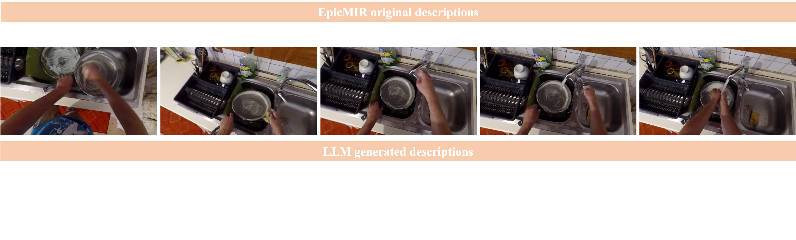

# 🎧 Audio Retrieval in Egocentric Videos

[](https://github.com/oncescuandreea/audio_egovlp)
[](https://www.robots.ox.ac.uk/~vgg/research/audio-retrieval/ego)
[](https://arxiv.org/abs/2402.19106)
[](LICENSE)

---



> ⚠️ **Codebase under active development** — check back soon for updates!

---

## 🧩 Setup Instructions

### 🛠️ Environment Installation

```bash
conda env create -f environment.yml
conda activate egovlp
python -m nltk.downloader stopwords
export PYTHONPATH=.
```

---

## 📦 Required Datasets

You’ll need the following datasets:

1. **AudioEgoMCQ**
2. **AudioEpicMIR**
3. **EpicSounds**

---

### 🎥 AudioEgoMCQ

Before running AudioEgoMCQ experiments:

1. **Request access to [Ego4D](https://ego4d-data.org/docs/start-here/#license-agreement)**.
2. Follow the [EgoVLP setup instructions](https://github.com/showlab/EgoVLP?tab=readme-ov-file#ego4d-videos-and-metadata).
3. Download the required data:

```bash
mkdir dataset && cd dataset
gdown "https://drive.google.com/uc?id=1-aaDu_Gi-Y2sQI_2rsI2D1zvQBJnHpXl"
gdown "https://drive.google.com/uc?id=1-5iRYf4BCHmj4MYQYFRMY4bhsWJUN3rW"
cd ..
gdown --folder https://drive.google.com/drive/folders/1gWto7N5rh5nmbWl3JGYsH5wYFzmSBi6J -O dataset/
mv dataset/audio_retrieval_egomcq/* dataset/.
rm -r dataset/audio_retrieval_egomcq/
```

Then process and extract video/audio chunks:

```bash
mkdir -p dataset
cd dataset
ln -s <path_to_ego4d_video_folder> ego4d
cd ..
python utils/video_resize.py --nproc 10 --subset mcq
python utils/video_chunk.py --task video_chunks --dataset egovlp --nproc 10
python utils/video_chunk.py --task audio_chunks --dataset egovlp --nproc 10
```

> Use `--subset mcq` for the MCQ subset or omit it for all videos.

---

### 🎬 AudioEpicMIR & EpicSounds

1. Download **EpicKitchens** videos:
   ```bash
   python epic_downloader.py --videos --test
   ```
2. Clone annotations:
   ```bash
   mkdir data && cd data
   git clone git@github.com:epic-kitchens/epic-kitchens-100-annotations.git
   cd ..
   ```

3. Download retrieval annotations:
   ```bash
   cd data
   gdown --folder https://drive.google.com/drive/folders/187Iy8MSdKlaipV_yhbMwyYazeu711A1f -O epic-kitchens-100-annotations/retrieval_annotations/
   gdown --folder https://drive.google.com/drive/folders/1OSYniORkyyhxPcClccZHkH73TS4WoenE -O epic-kitchens-100-annotations/retrieval_annotations/
   cd ..
   ```

> EpicSounds shares the same video data as EpicMIR, but uses different text annotations.

---

## 🧠 Pretrained Models

### 🎵 Audio Encoders

```bash
mkdir -p pretrained_models/audio_encoder
gdown --output pretrained_models/audio_encoder/HTSAT.ckpt "https://drive.google.com/uc?id=11XiCDsW3nYJ6uM87pvP3wI3pDAGhsBC1"
```

You can also explore checkpoints from:
- [WavCaps](https://github.com/XinhaoMei/WavCaps/tree/master/retrieval)
- [LAION-CLAP](https://github.com/LAION-AI/CLAP)

```bash
mkdir pretrained
gdown --output pretrained/HTSAT-BERT-FT-AudioCaps.pt "https://drive.google.com/uc?id=1-qm0UoDvzYUXajezQ7v7OZCDZRepg3K_"
gdown --output pretrained/HTSAT-BERT-FT-Clotho.pt "https://drive.google.com/uc?id=1werAcDdMLN0Fy1TNwHr3R6Z1NFX1J-6B"
wget https://huggingface.co/lukewys/laion_clap/resolve/main/630k-audioset-fusion-best.pt -P pretrained/
```

### 👁️ Vision Encoders

```bash
wget https://github.com/huggingface/pytorch-image-models/releases/download/v0.1-vitjx/jx_vit_base_p16_224-80ecf9dd.pth -P pretrained/
gdown --output pretrained/egovlp.pth "https://drive.google.com/uc?id=1-cP3Gcg0NGDcMZalgJ_615BQdbFIbcj7"
```

---

## 🚀 Running Experiments

> ⚠️ **Important:** Before running any experiment, make sure to **update the `data_dir`** field in your config file (e.g., `configs/eval/...json`) to point to your local dataset path.  
> Use `--use_gpt true` to enable LLM-generated audio descriptions and `--use_gpt false` to use original visual labels.

---

### 🎧 AudioEpicMIR (Table 1)

- **WavCaps model:** `configs/eval/epic_clap_wavcap.json`
- **Laion-CLAP model:** `configs/eval/epic_clap.json`

Example — *WavCaps with GPT-generated audio descriptions*:

```bash
python -m torch.distributed.launch   --nnodes=1 --node_rank=0 --nproc_per_node 1 --master_port 8082   ./run/test_epic_wavcaps.py   --config configs/eval/epic_clap_wavcap.json   --seed 0   --use_gpt true   --relevancy caption   --suffix ""   --folder <RESULTS_FOLDER>   --load_ckpt_aud /path/to/HTSAT-BERT-FT-Clotho.pt   --dual_softmax "False"
```

---

### 🎥 AudioEgoMCQ (Table 2)

- **WavCaps model:** `configs/eval/egomcq_clap_newer_wavcap.json`
- **Laion-CLAP model:** `configs/eval/egomcq_clap_newer.json`

Example — *CLAP model with visual labels as audio descriptions*:

```bash
python -m torch.distributed.launch   --nnodes=1 --node_rank=0 --nproc_per_node 1 --master_port 2044   ./run/train_egoclip_clap.py   --config configs/eval/egomcq_clap_newer.json   --seed 2   --use_gpt false   --val_file egomcq_aud_full_filtered_query_and_answer_filter_cliptextfull_silence.json   --test_file egomcq_aud_full_filtered_query_and_answer_filter_cliptextfull_silence.json
```

---

### 🔊 EpicSoundsRet (Table 3)

- **WavCaps model:** `configs/eval/epicsound_clap_wavcap.json`
- **Laion-CLAP model:** `configs/eval/epicsound_clap.json`

Example — *WavCaps with GPT audio descriptions*:

```bash
python -m torch.distributed.launch   --nnodes=1 --node_rank=0 --nproc_per_node 1 --master_port 8082   ./run/test_epic_wavcaps.py   --config configs/eval/epicsound_clap_wavcap.json   --seed 2   --folder folder_epicsounds   --val_test_split test   --use_gpt true   --load_ckpt_aud /path/to/HTSAT-BERT-FT-AudioCaps.pt   --dual_softmax "False"
```

---

### 🧮 AudioEpicMIR Relevancy Subsets (Table 4)

Use the `--suffix` flag to select the subset:

- `_gptfiltered_low` — low relevancy  
- `_gptfiltered_moderate` — moderate relevancy  
- `_gptfiltered_high` — high relevancy  

Example — *Moderate subset, WavCaps finetuned on AudioCaps*:

```bash
python -m torch.distributed.launch   --nnodes=1 --node_rank=0 --nproc_per_node 1 --master_port 2041   ./run/test_epic_wavcaps.py   --config configs/eval/epic_clap_wavcap.json   --seed 2   --use_gpt true   --relevancy caption   --suffix _gptfiltered_moderate   --folder folder_results_table4   --dual_softmax "False"
```

---

### 🎧 AudioEgoMCQ Relevancy Subsets (Table 5)

Adjust `--val_file` and `--test_file` as follows:

- `..._moderate_high.json` — low relevancy subset  
- `..._low_high.json` — moderate relevancy subset  
- `..._low_moderate.json` — high relevancy subset  

Example — *Moderate subset, WavCaps model finetuned on AudioCaps, visual labels as audio descriptions*:

```bash
python -m torch.distributed.launch   --nnodes=1   --node_rank=0   --nproc_per_node 1   --master_port 8083   ./run/train_egoclip_clap.py   --config configs/eval/egomcq_clap_newer_wavcap.json   --seed 1   --use_gpt false   --val_file egomcq_aud_full_filtered_query_and_answer_filter_cliptextfull_silence_low_high.json   --test_file egomcq_aud_full_filtered_query_and_answer_filter_cliptextfull_silence_low_high.json   --load_ckpt_aud /path/to/HTSAT-BERT-FT-AudioCaps.pt
```

---

## 🧾 Citation

If you find this work useful, please cite:

```bibtex
@InProceedings{Oncescu24,
  author = {Andreea-Maria Oncescu and Joao F. Henriques and Andrew Zisserman and Samuel Albanie and A. Sophia Koepke},
  title  = {A SOUND APPROACH: Using Large Language Models to generate audio descriptions for egocentric text-audio retrieval},
  booktitle = {ICASSP},
  year = {2024}
}

@article{kevin2022egovlp,
  title={Egocentric Video-Language Pretraining},
  author={Lin, Kevin Qinghong and Wang, Alex Jinpeng and Soldan, Mattia and Wray, Michael and Yan, Rui and Xu, Eric Zhongcong and Gao, Difei and Tu, Rongcheng and Zhao, Wenzhe and Kong, Weijie and others},
  journal={arXiv preprint arXiv:2206.01670},
  year={2022}
}

@inproceedings{laionclap2023,
  title = {Large-scale Contrastive Language-Audio Pretraining with Feature Fusion and Keyword-to-Caption Augmentation},
  author = {Wu*, Yusong and Chen*, Ke and Zhang*, Tianyu and Hui*, Yuchen and Berg-Kirkpatrick, Taylor and Dubnov, Shlomo},
  booktitle={IEEE International Conference on Acoustics, Speech and Signal Processing, ICASSP},
  year = {2023}
}

@article{mei2023wavcaps,
  title={WavCaps: A ChatGPT-Assisted Weakly-Labelled Audio Captioning Dataset for Audio-Language Multimodal Research},
  author={Mei, Xinhao and Meng, Chutong and Liu, Haohe and Kong, Qiuqiang and Ko, Tom and Zhao, Chengqi and Plumbley, Mark D and Zou, Yuexian and Wang, Wenwu},
  journal={arXiv:2303.17395},
  year={2023}
}

@article{damen2022rescaling,
   title={Rescaling Egocentric Vision},
   author={Damen, Dima and Doughty, Hazel and Farinella, Giovanni Maria  and and Furnari, Antonino 
           and Ma, Jian and Kazakos, Evangelos and Moltisanti, Davide and Munro, Jonathan 
           and Perrett, Toby and Price, Will and Wray, Michael},
  journal=ijcv,
  year={2022}
}

@inproceedings{EPICSOUNDS2023,
  title={{EPIC-SOUNDS}: {A} {L}arge-{S}cale {D}ataset of {A}ctions that {S}ound},
  author={Huh, Jaesung and Chalk, Jacob and Kazakos, Evangelos and Damen, Dima and Zisserman, Andrew},
  booktitle   = {International Conference on Acoustics, Speech, and Signal Processing},
  year      = {2023}
} 
```

*(See full references in the original README.)*

---

## ⚠️ Common Issues

```bash
ImportError: /lib64/libstdc++.so.6: version `CXXABI_1.3.8' not found
```

✅ Fix:
```bash
export LD_LIBRARY_PATH=$LD_LIBRARY_PATH:~/miniconda3/lib
```

More details [here](https://stackoverflow.com/questions/58424974/anaconda-importerror-usr-lib64-libstdc-so-6-version-glibcxx-3-4-21-not-fo).

---

## ✉️ Contact

Maintained by [**Andreea**](https://github.com/oncescuandreea)  
📧 `oncescuandreea@yahoo.com`

---

## 🙏 Acknowledgements

Built upon:
- [EgoVLP](https://qinghonglin.github.io/EgoVLP/)
- [WavCaps](https://github.com/XinhaoMei/WavCaps)
- [Laion-CLAP](https://github.com/LAION-AI/CLAP)

---

## 🪪 License

[MIT License](LICENSE)
