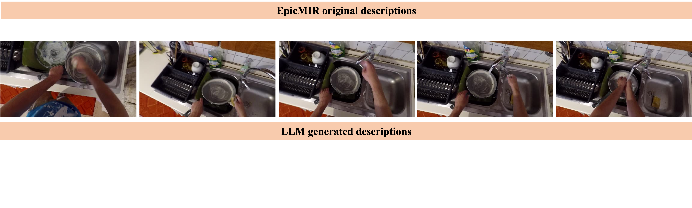

# Audio_EgoVLP: AudioRetrieval in Egocentric Videos

[Project page](https://github.com/oncescuandreea/audio_egovlp) | [arXiv](https://arxiv.org/abs/2402.19106)




## More data coming soon
EpicKitchens visual descriptions to GPT3.5 generated audio descriptions can be found [here](https://drive.google.com/drive/folders/187Iy8MSdKlaipV_yhbMwyYazeu711A1f?usp=sharing).

## Full code instructions coming soon

## Running experiments on EpicMIR text-audio retrieval using WavCaps models:
Create folder pretrained_models/audio_encoders and download in this folder the HTSAT following instructions from [here](https://github.com/XinhaoMei/WavCaps/tree/master/retrieval)

Put them under pretrained_models/audio_encoders.
```
python -m torch.distributed.launch --nnodes=1 --node_rank=0 --nproc_per_node 1 --master_port 8082  ./run/test_epic_wavcaps.py --config configs/eval/epic_clap_wavcap.json --seed 0 --use_gpt false --relevancy caption --suffix "" --folder <FOLDER IN WHICH TO SAVE RESULTS> --load_ckpt_aud <ADD FULL PATH TO PRETRAINED MODEL HERE> --dual_softmax "False"
```
checkpoint can be e.g. /your/path/HTSAT-BERT-FT-AudioCaps.pt found [here](https://drive.google.com/drive/folders/1pFr8IRY3E1FAtc2zjYmeuSVY3M5a-Kdj)


## 🎓 Citation

If you find our work helps, please consider citing our paper and the EgoVLP code-base.

```bibtex
@InProceedings{Oncescu24,
  author       = "Andreea-Maria Oncescu and Joao~F. Henriques and Andrew Zisserman and Samuel Albanie and Yang Liu and A. Sophia Koekpe",
  title        = "A SOUND APPROACH: Using Large Language Models to generate audio descriptions for egocentric text-audio retrieval",
  booktitle    = "International Conference on Acoustics, Speech, and Signal Processing ",
  month        = mar,
  year         = "2024",
  organization = "IEEE",
  keywords     = "Audio, retrieval",
}


@article{kevin2022egovlp,
  title={Egocentric Video-Language Pretraining},
  author={Lin, Kevin Qinghong and Wang, Alex Jinpeng and Soldan, Mattia and Wray, Michael and Yan, Rui and Xu, Eric Zhongcong and Gao, Difei and Tu, Rongcheng and Zhao, Wenzhe and Kong, Weijie and others},
  journal={arXiv preprint arXiv:2206.01670},
  year={2022}
}


@inproceedings{laionclap2023,
  title = {Large-scale Contrastive Language-Audio Pretraining with Feature Fusion and Keyword-to-Caption Augmentation},
  author = {Wu*, Yusong and Chen*, Ke and Zhang*, Tianyu and Hui*, Yuchen and Berg-Kirkpatrick, Taylor and Dubnov, Shlomo},
  booktitle={IEEE International Conference on Acoustics, Speech and Signal Processing, ICASSP},
  year = {2023}
}


@article{mei2023wavcaps,
  title={WavCaps: A ChatGPT-Assisted Weakly-Labelled Audio Captioning Dataset for Audio-Language Multimodal Research},
  author={Mei, Xinhao and Meng, Chutong and Liu, Haohe and Kong, Qiuqiang and Ko, Tom and Zhao, Chengqi and Plumbley, Mark D and Zou, Yuexian and Wang, Wenwu},
  journal={arXiv:2303.17395},
  year={2023}
}
```


## ✉️ Contact

This repo is maintained by [Andreea](https://github.com/oncescuandreea). Questions and discussions are welcome via `oncescu@robots.ox.ac.uk`.

## 🙏 Acknowledgements

This codebase is based on [EgoVLP](https://qinghonglin.github.io/EgoVLP/), [WavCaps](https://github.com/XinhaoMei/WavCaps/tree/master), [Laion-CLAP](https://github.com/LAION-AI/CLAP)

## LICENSE

MIT
